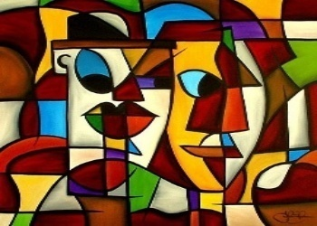
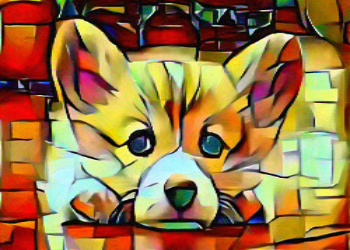
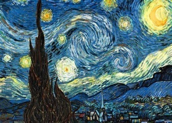
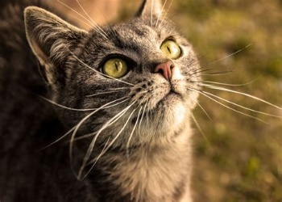
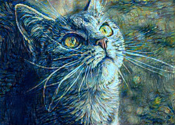
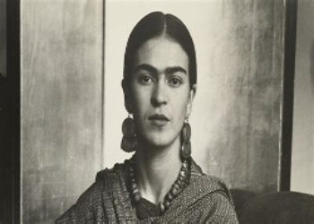
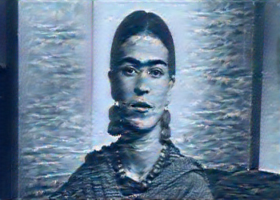

# Art with CNN: Artistic Style Transfer in Pytorch

[](LICENSE)

An approach to implement artistic stylized effects on images, loosely based on the implementation of [A Neural Algorithm of Artistic Style](https://arxiv.org/abs/1508.06576) by _Gatys_, _Ecker_, and _Bethge_.
This implementation extracts features representing style and content from different layers in VGG-19 network, followed by manipulating both representations independently to produce stylized effects on the input image. There is a slight modification in the use of max-pooling layers as opposed to the use of average pooling in the paper.

Pre-trained VGG19's weights from PyTorch's model zoo is used in this implementation.

<p float="left", align="middle">
  
   
  
</p>
<p float="left", align="middle">
  
   
  
</p>
<p float="left", align="middle">
  
   
  
</p>

## Table of Contents
<!-- MarkdownTOC autolink="true" bracket="round" autoanchor="false" lowercase="only_ascii" uri_encoding="true" levels="1,2,3,4" -->
1. [Requirements](#Requirements)
2. [Usage](#usage)
3. [Attribution](#attribution)
<!-- /MarkdownTOC -->
## Requirements

Implementation takes considerable amount of time to produce results without GPU, it is advisable to use a CUDA capable GPU device.

### Necessary libraries
- PyTorch
- Numpy

## Usage
### Project structure:
Here's an overview of project structure,

[Main](nst.py) : Main program to implement stylized effects on images

[Utilities](utils.py): Performs necessary image transformation and also extracts loss at different layers of VGG19 network

[Ancillary Functions](loss_functions.py): Defines necessary loss functions

### Arguments:

`--style_image`: Path to style image

`--content_image`: Path to content image

`--style_weight` (Optional):  Defaults to 1e6

`--content_weight` (Optional): Defaults to 1

`--num_iter` (Optional): Set the number of iterations (between 300-800) defaults to 300

To run,
```
python nst.py --style_image <path to style image> --content_image <path to content image>
```


## Attribution
This work borrows some implementation from:
- PyTorch's [Neural Style Tutorial](https://pytorch.org/tutorials/advanced/neural_style_tutorial.html)